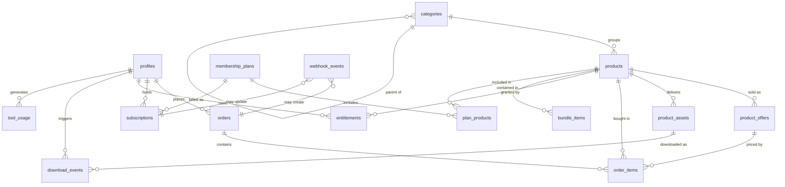

# SODALES Database Plan

Supabase Postgres. **No migrations have been written yet** — this is the design to validate
before Phase 4 creates anything.

Every table below gets RLS enabled. A table with RLS enabled and no policy denies everything,
which is the correct default: start closed, open deliberately.

---

## 1. Entity relationships



---

## 2. Enumerated values

Postgres enums for stable sets; `text` + `CHECK` where values are likely to grow.

```sql
user_role           : customer | admin
product_type        : download | template | prompt_system | workflow | automation
                    | database | course | tool | bundle | external_access
product_status      : draft | published | archived
fulfillment_type    : file | external_link | protected_page | video
                    | license_key | tool_access | subscription_access | instructions
offer_kind          : free | one_time | subscription
order_status        : pending | paid | refunded | partially_refunded | failed
subscription_status : active | on_trial | past_due | paused | cancelled | expired
entitlement_source  : free | purchase | bundle | manual
webhook_status      : received | processed | failed | ignored
```

---

## 3. Tables

### profiles

Mirrors `auth.users`. Created by a trigger on user signup.

| Column | Type | Notes |
| --- | --- | --- |
| `id` | uuid PK | FK → `auth.users.id`, on delete cascade |
| `email` | text not null | |
| `full_name` | text | |
| `avatar_url` | text | |
| `role` | `user_role` not null default `'customer'` | **Authorization source of truth** |
| `marketing_opt_in` | boolean default false | |
| `created_at` / `updated_at` | timestamptz | |

`role` must never be writable by the user. Enforced twice: a column-level revoke, and a
trigger that raises if a non-admin changes it. See §5.2.

### categories

| Column | Type | Notes |
| --- | --- | --- |
| `id` | uuid PK | |
| `slug` | text unique not null | URL segment |
| `name` | text not null | |
| `description` | text | |
| `parent_id` | uuid | self-FK, nullable; one level of nesting only in V1 |
| `sort_order` | int default 0 | |
| `created_at` | timestamptz | |

### products

The catalog. **Bundles are products** with `product_type = 'bundle'` — see §7.1.

| Column | Type | Notes |
| --- | --- | --- |
| `id` | uuid PK | |
| `slug` | text unique not null | |
| `name` | text not null | |
| `tagline` | text | One-line outcome statement, used on cards |
| `description` | text | Markdown, product page body |
| `product_type` | `product_type` not null | |
| `status` | `product_status` not null default `'draft'` | Only `published` is publicly visible |
| `category_id` | uuid | FK → categories, nullable |
| `cover_image_url` | text | |
| `is_featured` | boolean default false | |
| `requirements` | text | "You need an n8n instance", etc. |
| `license_terms` | text | |
| `seo_title` / `seo_description` / `og_image_url` | text | |
| `search_vector` | tsvector | Generated column, see §4 |
| `published_at` | timestamptz | |
| `created_at` / `updated_at` | timestamptz | |

### product_offers

Separates *what a product is* from *how it is sold*. A product may have several offers
(personal / commercial license, launch pricing), and provider IDs live here — so re-pricing
or changing payment provider never touches product content.

| Column | Type | Notes |
| --- | --- | --- |
| `id` | uuid PK | |
| `product_id` | uuid not null | FK → products, cascade |
| `name` | text not null | "Standard license" |
| `kind` | `offer_kind` not null | |
| `price_cents` | int not null default 0 | 0 required when `kind = 'free'` |
| `compare_at_cents` | int | Struck-through anchor price |
| `currency` | char(3) not null default `'USD'` | |
| `provider` | text | e.g. `lemon_squeezy`; null for free offers |
| `provider_variant_id` | text | The checkout target |
| `is_default` | boolean default false | One per product, partial unique index |
| `is_active` | boolean default true | |

### product_assets

What the customer actually receives. Multiple per product.

| Column | Type | Notes |
| --- | --- | --- |
| `id` | uuid PK | |
| `product_id` | uuid not null | FK → products, cascade |
| `fulfillment_type` | `fulfillment_type` not null | |
| `title` | text not null | |
| `description` | text | |
| `storage_path` | text | Path in `protected-assets`, for `file` / `video` |
| `external_url` | text | For `external_link` |
| `body` | text | For `instructions` / `protected_page` (markdown) |
| `tool_slug` | text | For `tool_access`, routes to `/dashboard/tools/[slug]` |
| `file_size_bytes` | bigint | |
| `is_preview` | boolean default false | Preview assets are publicly readable |
| `sort_order` | int default 0 | |
| `created_at` | timestamptz | |

A `CHECK` constraint enforces that the right column is populated for each
`fulfillment_type` — a `file` asset without a `storage_path` is invalid data.

### bundle_items

| Column | Type | Notes |
| --- | --- | --- |
| `bundle_product_id` | uuid | FK → products, must have `product_type = 'bundle'` |
| `child_product_id` | uuid | FK → products |
| `sort_order` | int default 0 | |

PK `(bundle_product_id, child_product_id)`. A `CHECK` prevents self-reference; nested bundles
are not supported in V1.

### orders

| Column | Type | Notes |
| --- | --- | --- |
| `id` | uuid PK | |
| `user_id` | uuid | FK → profiles, **nullable** — guest checkout is reconciled by email |
| `customer_email` | text not null | Always captured, used for reconciliation |
| `provider` | text not null | |
| `provider_order_id` | text not null | **Unique per provider** |
| `status` | `order_status` not null | |
| `subtotal_cents` / `total_cents` / `tax_cents` | int not null | |
| `currency` | char(3) not null | |
| `raw_payload` | jsonb | Full provider payload for audit and replay |
| `created_at` / `updated_at` | timestamptz | |

Unique index on `(provider, provider_order_id)`.

### order_items

| Column | Type | Notes |
| --- | --- | --- |
| `id` | uuid PK | |
| `order_id` | uuid not null | FK → orders, cascade |
| `product_id` | uuid | FK → products, **null on delete** — order history must survive product deletion |
| `offer_id` | uuid | FK → product_offers, null on delete |
| `product_name_snapshot` | text not null | Name at purchase time |
| `unit_price_cents` | int not null | |
| `quantity` | int not null default 1 | |

Snapshotting the name means a renamed or deleted product does not corrupt past receipts.

### membership_plans

| Column | Type | Notes |
| --- | --- | --- |
| `id` | uuid PK | |
| `slug` | text unique not null | |
| `name` / `description` | text | |
| `price_cents` | int not null | |
| `currency` | char(3) default `'USD'` | |
| `interval` | text `CHECK (interval IN ('month','year'))` | |
| `provider` / `provider_variant_id` | text | |
| `features` | jsonb | Pricing-page bullet list |
| `ai_monthly_quota` | int | Null = no AI access on this plan |
| `is_active` | boolean default true | |
| `sort_order` | int default 0 | |

### plan_products

PK `(plan_id, product_id)`. The membership inclusion list. Editing it changes access for
every member immediately — see §6.

### subscriptions

| Column | Type | Notes |
| --- | --- | --- |
| `id` | uuid PK | |
| `user_id` | uuid not null | FK → profiles |
| `plan_id` | uuid | FK → membership_plans |
| `provider` | text not null | |
| `provider_subscription_id` | text not null | Unique per provider |
| `status` | `subscription_status` not null | |
| `current_period_end` | timestamptz | **Access runs until this moment, even after cancellation** |
| `cancel_at_period_end` | boolean default false | |
| `trial_ends_at` / `ends_at` | timestamptz | |
| `raw_payload` | jsonb | |
| `created_at` / `updated_at` | timestamptz | |

Partial unique index: one non-terminal subscription per user.

### entitlements

Materialized, permanent grants only. Membership access is **not** stored here (§6).

| Column | Type | Notes |
| --- | --- | --- |
| `id` | uuid PK | |
| `user_id` | uuid not null | FK → profiles |
| `product_id` | uuid not null | FK → products |
| `source` | `entitlement_source` not null | |
| `source_ref` | text | Order id, bundle product id, or admin note |
| `granted_at` | timestamptz not null default now() | |
| `expires_at` | timestamptz | Null = permanent |
| `revoked_at` | timestamptz | Set on refund; rows are never deleted |
| `granted_by` | uuid | FK → profiles, for manual grants |

Unique index on `(user_id, product_id, source, coalesce(source_ref, ''))`. This is what makes
webhook retries safe at the entitlement level, in addition to `webhook_events`.

### webhook_events

**Not in the original brief; added deliberately.** Payment providers retry webhooks — on
timeout, on 5xx, and sometimes spuriously. Without a dedupe table, a retry grants the
entitlement twice and double-counts revenue. This table is the reason that cannot happen.

| Column | Type | Notes |
| --- | --- | --- |
| `id` | uuid PK | |
| `provider` | text not null | |
| `provider_event_id` | text not null | **Unique per provider — the idempotency key** |
| `event_name` | text not null | Raw provider event name |
| `payload` | jsonb not null | |
| `status` | `webhook_status` not null default `'received'` | |
| `error` | text | |
| `received_at` / `processed_at` | timestamptz | |

Unique index on `(provider, provider_event_id)`. Handler flow: insert with
`ON CONFLICT DO NOTHING`; if no row was inserted, this event was already handled — return 200
and stop.

### download_events

| Column | Type | Notes |
| --- | --- | --- |
| `id` | uuid PK | |
| `user_id` | uuid not null | FK → profiles |
| `product_id` / `asset_id` | uuid | FK, null on delete |
| `user_agent` | text | |
| `created_at` | timestamptz | |

No IP address stored — it adds GDPR obligations without answering a business question.

### tool_usage

Cost accounting for AI. Written on **every** call, including failures.

| Column | Type | Notes |
| --- | --- | --- |
| `id` | uuid PK | |
| `user_id` | uuid not null | FK → profiles |
| `tool_slug` | text not null | |
| `product_id` | uuid | FK → products |
| `provider` / `model` | text not null | |
| `input_tokens` / `output_tokens` | int | |
| `cost_micro_usd` | bigint | Micro-dollars — integer arithmetic, no float rounding |
| `status` | text | `success` / `error` / `rate_limited` / `quota_exceeded` |
| `latency_ms` | int | |
| `created_at` | timestamptz | |

### email_subscribers

Lead-magnet capture, separate from accounts.

| Column | Type | Notes |
| --- | --- | --- |
| `id` | uuid PK | |
| `email` | text unique not null | |
| `source` | text | `lead_magnet` / `footer` / `checkout` |
| `lead_magnet_product_id` | uuid | FK → products |
| `confirmed_at` / `unsubscribed_at` | timestamptz | |
| `created_at` | timestamptz | |

---

## 4. Indexes and search

```sql
products (slug) unique
products (status, published_at desc)
products (category_id) where status = 'published'
products (product_type) where status = 'published'
products using gin (search_vector)

product_offers (product_id)
product_offers (product_id) unique where is_default   -- one default per product
product_assets (product_id, sort_order)
bundle_items  (bundle_product_id)
bundle_items  (child_product_id)

orders (user_id, created_at desc)
orders (provider, provider_order_id) unique
orders (customer_email)               -- guest-order reconciliation
order_items (order_id)

subscriptions (user_id)
subscriptions (provider, provider_subscription_id) unique
subscriptions (user_id) unique where status in ('active','on_trial','past_due')

entitlements (user_id, product_id)
entitlements (user_id) where revoked_at is null
entitlements (user_id, product_id, source, coalesce(source_ref,'')) unique

webhook_events (provider, provider_event_id) unique
tool_usage (user_id, created_at desc)
download_events (user_id, created_at desc)
```

Search is Postgres full-text — no Algolia or Typesense in V1.

```sql
search_vector tsvector generated always as (
  setweight(to_tsvector('english', coalesce(name, '')),        'A') ||
  setweight(to_tsvector('english', coalesce(tagline, '')),     'B') ||
  setweight(to_tsvector('english', coalesce(description, '')), 'C')
) stored
```

---

## 5. Row Level Security

RLS enabled on every table listed above. Policies are additive; anything not granted is denied.

### 5.1 Policy summary

| Table | anon | authenticated | admin |
| --- | --- | --- | --- |
| `profiles` | — | select/update own row (not `role`) | all |
| `categories` | select | select | all |
| `products` | select where `published` | select where `published` | all |
| `product_offers` | select where product published and active | same | all |
| `product_assets` | select where `is_preview` | select where `is_preview` | all |
| `bundle_items` | select where bundle published | same | all |
| `orders` / `order_items` | — | select own | all |
| `membership_plans` | select where active | select where active | all |
| `plan_products` | select | select | all |
| `subscriptions` | — | select own | all |
| `entitlements` | — | select own | all |
| `download_events` / `tool_usage` | — | select own | all |
| `webhook_events` | — | — | — (service role only) |
| `email_subscribers` | insert only | insert only | all |

Note what is missing: **no client-side insert or update on `orders`, `entitlements` or
`subscriptions`.** Those are written exclusively by the service-role client inside webhook
handling. A customer cannot grant themselves anything even with a valid session.

Protected `product_assets` rows are never client-readable. The download route reads them with
the admin client after an entitlement check.

### 5.2 Admin authorization

```sql
create function public.is_admin() returns boolean
language sql stable security definer set search_path = public as $$
  select exists (
    select 1 from public.profiles
    where id = auth.uid() and role = 'admin'
  );
$$;
```

`security definer` with a pinned `search_path` is required — without the pin, a hostile
`search_path` can redirect the table lookup.

Protecting the `role` column, both layers required:

```sql
revoke update (role) on public.profiles from authenticated;
```

plus a `before update` trigger that raises if `role` changed and the caller is not an admin.
The revoke handles direct API updates; the trigger handles everything else.

Do **not** use `auth.users.raw_user_meta_data` for roles — it is user-writable through the
Supabase client and would allow trivial self-promotion to admin.

The first admin is set manually via SQL in the Supabase dashboard; there is no self-service
path to the admin role.

### 5.3 Access helper

```sql
create function public.can_access_product(p_product_id uuid, p_user_id uuid default auth.uid())
returns boolean
language sql stable security definer set search_path = public as $$
  select
    -- free
    exists (select 1 from product_offers o
            where o.product_id = p_product_id and o.kind = 'free' and o.is_active)
    -- direct, bundle or manual grant
    or exists (select 1 from entitlements e
               where e.user_id = p_user_id and e.product_id = p_product_id
                 and e.revoked_at is null
                 and (e.expires_at is null or e.expires_at > now()))
    -- active membership including this product
    or exists (select 1 from subscriptions s
               join plan_products pp on pp.plan_id = s.plan_id
               where s.user_id = p_user_id
                 and pp.product_id = p_product_id
                 and s.status in ('active','on_trial')
                 and (s.current_period_end is null or s.current_period_end > now()));
$$;
```

The TypeScript `canUserAccessProduct()` mirrors this exactly and returns the *reason*, so the
UI can distinguish "you own this" from "included with your membership". Both must be changed
together; a test asserts they agree.

---

## 6. Why membership access is computed, not stored

Purchases and bundle grants are permanent facts, so they are materialized as `entitlements`
rows at webhook time. Membership access is a *derived* condition and is evaluated at read time
by joining `subscriptions → plan_products`.

The reason is operational. If membership access were materialized, then adding a product to a
plan would require backfilling a row for every current member, removing one would require
revoking them, and a failed backfill would leave members silently locked out of something they
are paying for. Computing it means editing `plan_products` takes effect for everyone in the
next request, with no migration and nothing to go stale.

The cost is one extra join on access checks — negligible with the indexes in §4, and the
correctness is worth far more than the microseconds.

**Consequence to remember:** when a subscription lapses, membership-derived access disappears
automatically. Anything a member should keep permanently must be written as a real
`entitlements` row at the time it is earned.

---

## 7. Changes from the original brief

### 7.1 No separate `bundles` table

The brief listed `bundles` and `bundle_items`. A bundle needs a slug, a product page, a
description, artwork, offers, SEO metadata and a place in the catalog — every one of which
`products` already provides. A separate table would duplicate all of it and force the
storefront to handle two kinds of purchasable thing everywhere.

So a bundle is a row in `products` with `product_type = 'bundle'`, and `bundle_items` maps it
to its children. Buying a bundle grants an entitlement for the bundle product *and* one
`source = 'bundle'` entitlement per child, so the library lists the individual items.

### 7.2 `webhook_events` added

Idempotency for provider retries. Explained above; this is the most important addition.

### 7.3 `email_subscribers` added

The brief calls for a lead magnet and email capture but lists no table for it.

### 7.4 `entitlements` has no `membership` source

Deliberate, per §6. The `AccessResult.reason` union still includes `'membership'` because it
is a valid *reason for access*; it is simply not a stored row.

---

## 8. Migration discipline

- Every change is a timestamped file in `supabase/migrations/`. Nothing is edited by hand in
  the Supabase dashboard except the initial admin role assignment.
- Dev project first, verify, then production.
- Regenerate `lib/supabase/types.ts` after every migration.
- Destructive operations (`drop`, `truncate`, destructive `alter`) must be flagged explicitly
  and approved before running. Never bundled quietly into a larger migration.
- Additive changes preferred: add a nullable column, backfill, then constrain — rather than
  altering in place.
- `supabase/tests/` holds pgTAP tests asserting RLS actually denies cross-user reads. Written
  in Phase 6 alongside entitlements, not deferred to launch week.
